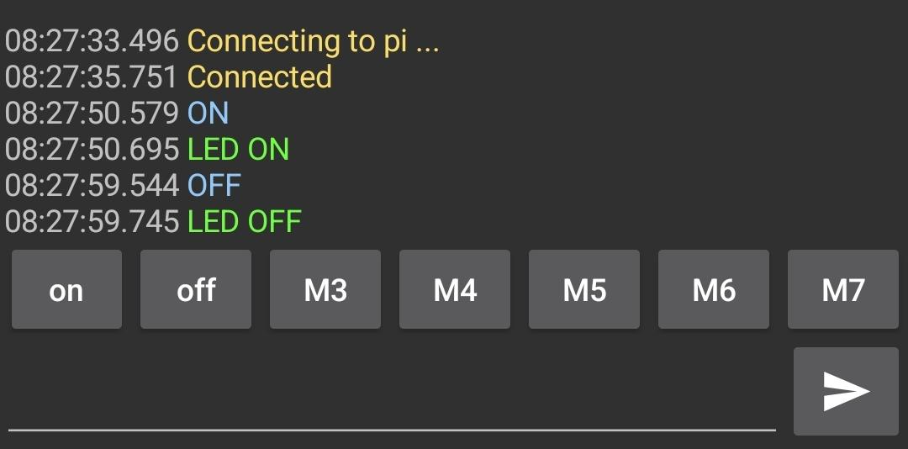
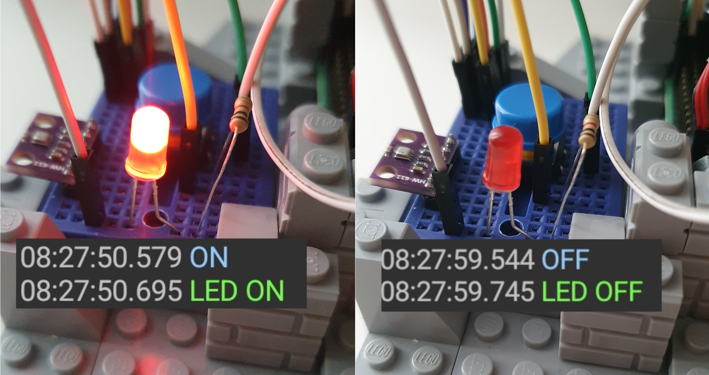
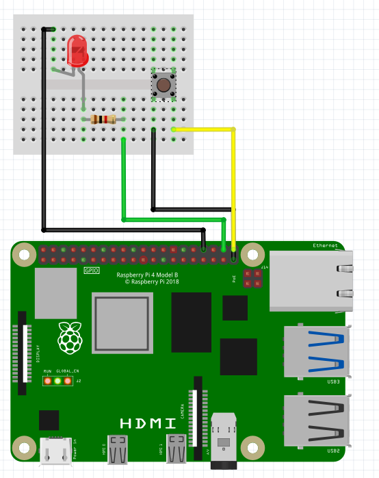

# bluetooth-led-control

control LED using RPi via bluetooth


### Installation/configuration
```
sudo apt update
sudo apt install bluez
```

configure bluetooth
```
sudo systemctl stop bluetooth
sudo /usr/sbin/bluetoothd -C &
sudo sdptool add SP
sudo rfcomm watch hci0 1
```
now connect via serial bluetooth terminal


on the second terminal
```
python3 -m venv venv
source venv/bin/activate
pip3 install RPi.GPIO pyserial
deactivate

chmod +x start.sh
```

### Running

```
./start.sh
```
now in serial bluetooth terminal send OFF or ON to rpi

###Photos

in serial bluetooth terminal app



how it works



diagram


